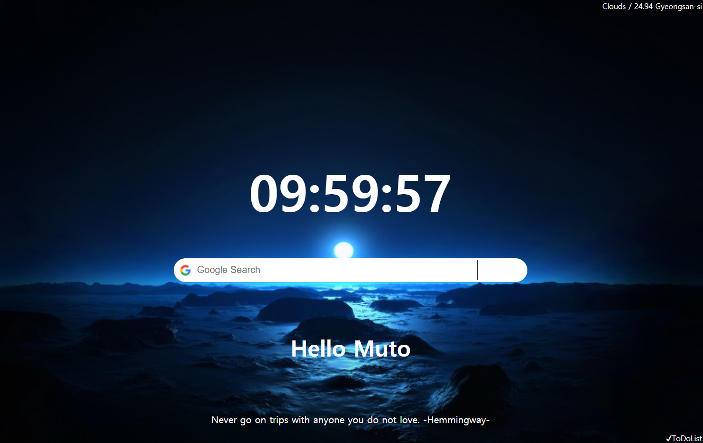

# Momentum
JS로 만든 Momentum

기능
- Clock
- Google Search
- Greeting
- Random Quote
- To Do List
- Weather
- Random Background

실행 : https://parkmuhyeun.github.io/Momentum/

*오른쪽 아래 ToDoList 클릭하면 To Do List기능 사용가능
